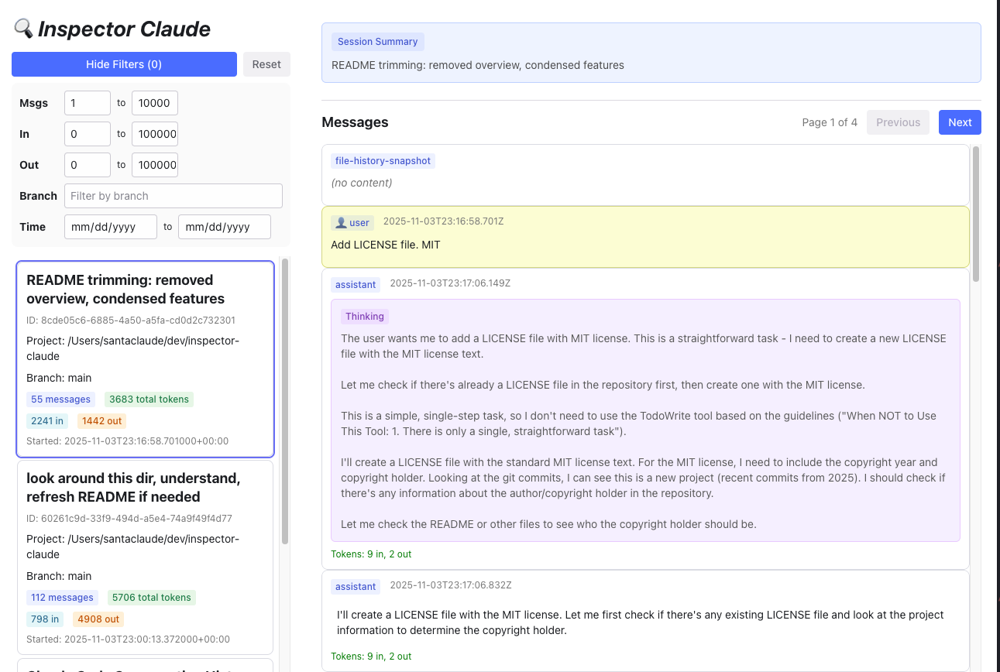

# 🔍 Inspector Claude

Web UI for exploring and analyzing your local Claude Code session data. Built entirely in Python using [Reflex](https://reflex.dev) - session metadata loads at startup, messages load on-demand.



## ✨ Features

- 🔎 Filter by message count, tokens, git branch, and date
- 📝 View complete session messages and interactions
- 🤖 **Agent side-chain support** - navigate into Task tool agent executions
- 🛠️ Expandable tool use/result blocks
- 💭 See Claude's internal thinking process
- 📊 Track token usage
- ⚡ Auto-refresh and pagination

## 🚀 Quick Start

**Requirements:** Python 3.10+ and [UV](https://docs.astral.sh/uv/) package manager

```bash
# Clone and install
git clone https://github.com/santaclaude2025/inspector-claude.git
cd inspector-claude
uv sync

# Run
uv run reflex run
```

The web interface will be available at `http://localhost:3000`.

## 📁 Data Source

Reads Claude Code session data from `~/.claude/projects/*.jsonl`

